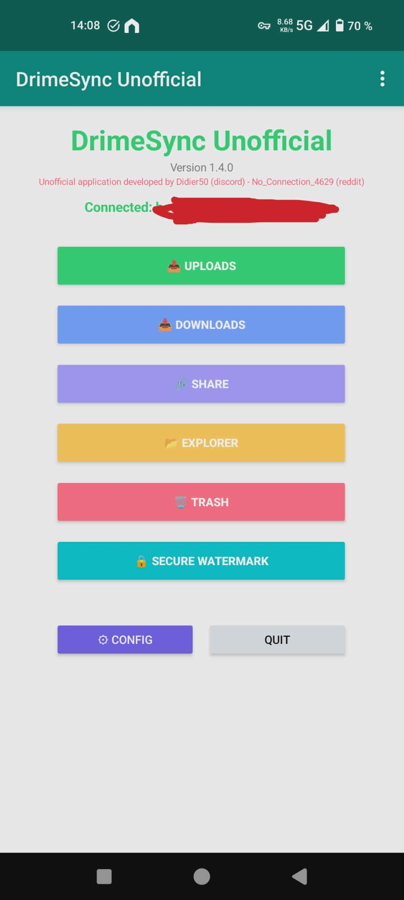
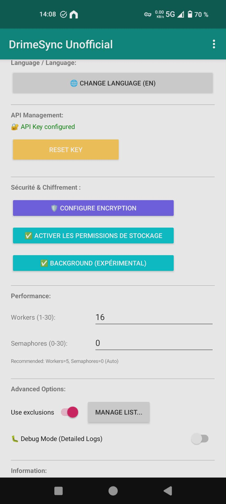
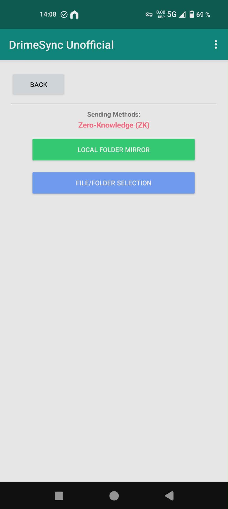
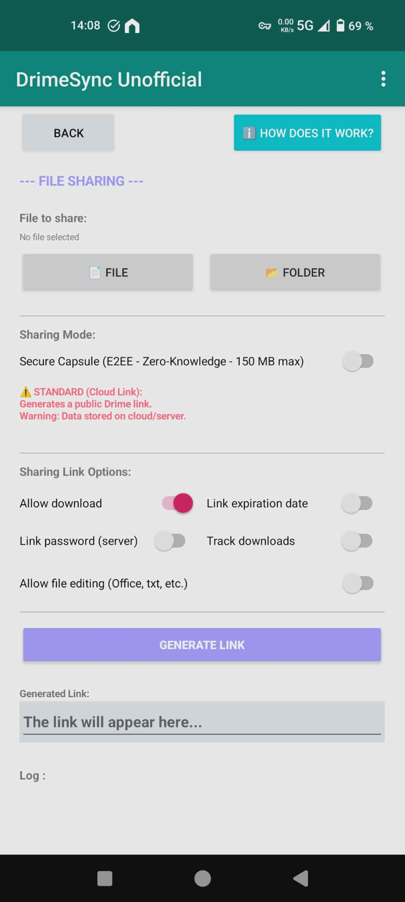
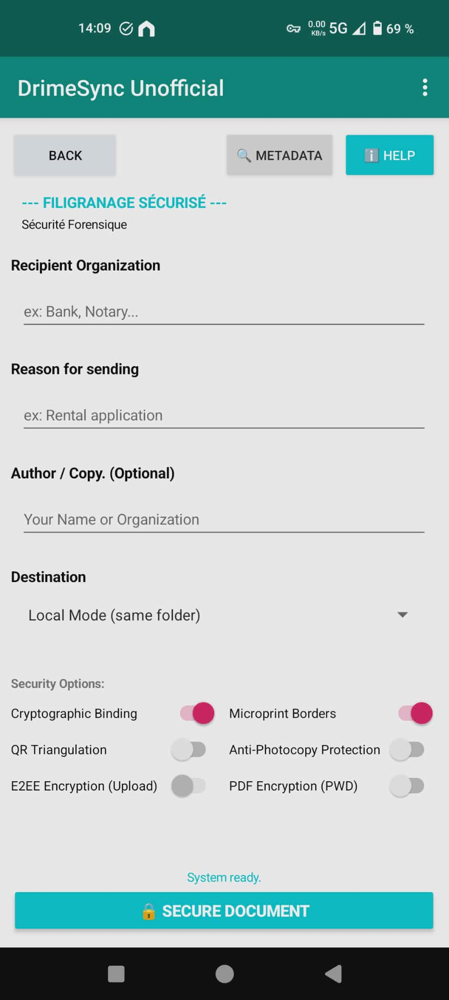

# DrimeSync Unofficial

[](https://github.com/NoConnection4629/DrimeSyncUnofficial/releases/latest)


[](LICENSE)


> 🔒 **Client non officiel pour Drime Cloud avec chiffrement End-to-End (E2EE) et Zero Knowladge **

Un client cross-platform pour Drime Cloud, construit avec Python et BeeWare.

## 🛡️ Sécurité & Architecture
<p align="center">
  
  
  
</p>

---
## 📱 Aperçu de l'interface
<p align="center">
  
  
  
  
  
</p>


## ✨ Caractéristiques Principales

### 🌍 Cross-Platform Natif
UI native WinForms/WPF via Toga, Native Android SDK + gestion batterie optimisée
**Normalement aussi ios mais à tester **

### 🔐 Sécurité Zero-Trust
- **Chiffrement E2EE** : XChaCha20-Poly1305 (IETF)
- **Dérivation de clés** : Argon2id (résistant aux attaques GPU)
- **3 modes de chiffrement** :
  - 🔵 **Standard** : Pas de chiffrement (rapidité maximale)
  - 🟢 **Avancé** : Contenu + noms de fichiers chiffrés
  - 🔴 **Zero-Knowledge** : Opacité totale (extensions + structure obfusquées)
- **Double authentification (2FA)** : Protection de l'application

### 🚀 Performance
- **Sync différentiel** : Optimisation API via cache local
- **Multi-threading** : Uploads parallèles pour saturer la bande passante
- **Multipart optimisé** : Gestion intelligente des gros fichiers (>30 MB)
- **Retry automatique** : Reprise sur erreur réseau

### 🎯 Fonctionnalités Avancées
- **Mode Miroir** : Synchronisation one-way automatique
- **Capsules sécurisées** : Partage offline avec HTML auto-décryptant (AES-256-GCM)
- **Filigranage** : Ajout de QR codes et micro-texte pour traçabilité (OmegaEngine)
- **Exclusion intelligente** : Support glob patterns (`.drimesyncignore`)
- **Gestion corbeille** : Restauration/suppression définitive


---

## 🚀 Quickstart

### Première Configuration

1. **Obtenir votre clé API** :
   - Connectez-vous à https://app.drime.cloud/
   - Copiez votre clé API personnelle - vous pouvez la générer dans vos paramètres de sécurité

2. **Configurer l'application** :
   ```
   Menu > Configuration
   - Coller la clé API
   - Choisir un dossier de synchronisation local
   - Sélectionner le workspace Drime
   ```

3. **Activer le chiffrement (optionnel)** :
   ```
   Menu > Sécurité
   - Activer E2EE Avancé ou Zero-Knowledge
   - Définir un mot de passe fort => attention : utlisez un gestionnaire de mot de passe pour le sauvegarder !!!
   - Exporter le sel pour multi-appareils
   ```

4. **Lancer la sync** :
   ```
   Menu > Upload Miroir > Démarrer
   ```

---

## 🛠️ Développement

### Prérequis

- Python 3.10+
- Git
- WiX Toolset (pour MSI Windows)
- Android SDK + JDK 11+ (pour APK Android)

### Installation Développeur

```bash
# Cloner le repo
git clone https://github.com/your-repo/drimesyncunofficial.git
cd drimesyncunofficial

# Créer environnement virtuel
python -m venv venv
source venv/bin/activate  # Windows: venv\Scripts\activate

# Installer Briefcase
pip install briefcase

# Lancer en mode dev (hot reload)
briefcase dev
```

### Build des Distributables

**Windows MSI** :
```bash
briefcase create windows
briefcase build windows
briefcase package windows
# Output: dist/DrimeSync_Unofficial-1.4.0.msi
```

**Android APK** :
```bash
briefcase create android
briefcase build android
briefcase package android
briefcase run android  # Test sur émulateur/device
# Output: dist/DrimeSync_Unofficial-1.4.0.apk
```

### Tests

Le projet maintient **212 tests** avec **0 échecs** :

```bash
# Tests complets
pytest

# Tests avec couverture
pytest --cov=src/drimesyncunofficial --cov-report=html

# Tests mypy (type hints)
pytest tests/test_mypy_validation.py

# Tests spécifiques
pytest tests/test_security.py -v
```

**Frameworks de test** :
- `pytest` : Tests unitaires et intégration
- `hypothesis` : Property-based testing (fuzzing)
- `unittest.mock` : Mocking API et filesystem
- `pytest-asyncio` : Tests asynchrones

---

## 📦 Architecture Technique

### Stack Technologique

| Composant | Techno | Rôle |
|-----------|--------|------|
| **GUI** | Toga | Widgets natifs cross-platform |
| **Packaging** | Briefcase | MSI/APK/DMG builds |
| **Réseau** | requests | API REST synchrone |
| **Crypto** | PyNaCl (libsodium) | Chiffrement E2EE |
| **Crypto Legacy** | cryptography | Capsules HTML (Web Crypto API) |
| **2FA** | pyotp | TOTP generation/validation |
| **QR Codes** | qrcode + Pillow | Génération codes-barres |
| **PDF** | pypdf + reportlab | Filigranage documents |

### Modules Principaux

```
src/drimesyncunofficial/
├── app.py                      # Point d'entrée, lifecycle
├── api_client.py               # Interface REST API (212 LOC, mypy-clean)
├── security.py                 # UI config E2EE + 2FA
├── base_transfer_manager.py    # Base abstraite uploads/downloads (mypy-clean)
├── uploads_mirror.py           # Sync différentiel one-way
├── uploads_mirror_e2ee.py      # Variant E2EE du miroir
├── downloads_*.py              # Managers de téléchargement
├── share.py                    # Capsules sécurisées HTML
├── filigranage*.py             # OmegaEngine watermarking
├── utils.py                    # Helpers (exclusion, hashing, etc.)
├── android_utils.py            # Wakelock, battery, clipboard (100% testé)
└── ui_thread_utils.py          # Thread-safe UI updates (100% testé)
```

### Spécifications Cryptographiques

**Primitives (v1.4.0)** :
- **Chiffrement symétrique** : XChaCha20-Poly1305 (AEAD)
- **Dérivation de clés** : Argon2id (mémoire: 512 MB, itérations: 3)
- **Noms de fichiers** : XChaCha20 déterministe (nonce via BLAKE2b)
- **Capsules HTML** : AES-256-GCM (compatibilité Web Crypto API)

**Gestion du sel** :
- Généré aléatoirement (16 bytes) à l'installation
- Stocké dans `E2EE_sync_salt.json`
- Exportable en Base64 pour multi-appareils

---

## 🐛 Bugs Connus & Limitations

| Bug | Impact | Workaround |
|-----|--------|------------|
| Fichier nommé exactement "0" | Renommé en "0.renamed" | Automatiquement restauré au download |
| Workspace par défaut (ID: 0) | HTTP 403 fréquents | Utiliser un workspace dédié |
| Android: Noms UTF-8 exotiques | Possibles problèmes affichage | Éviter emoji/caractères non-latins |

---

## 📊 Statistiques Projet

- **212 tests** (100% pass rate) ✅
- **59 fichiers de tests** (couverture: 46%)
- **38 modules source** (~12,000 LOC)
- **11 langues supportées** (i18n: EN, FR, DE, ES, IT, NL, PL, PT, SV, JA, ZH)
- **Type hints** : 2 fichiers mypy-strict clean

---

## 📄 Licence & Disclaimer

**Licence** : Voir fichier `LICENSE`

**⚠️ DISCLAIMER IMPORTANT** :
Ceci est un client **non officiel**. Il n'est **ni affilié, ni endorsé, ni connecté** au service officiel Drime Cloud. Utilisation strictement **à vos propres risques**. Les auteurs n'assument **aucune responsabilité** pour la perte de données ou failles de sécurité.

---

## 🤝 Contribution

Les contributions sont les bienvenues ! 

1. Fork le projet
2. Créer une branche feature (`git checkout -b feature/AmazingFeature`)
3. Commit les changements (`git commit -m 'Add AmazingFeature'`)
4. Push vers la branche (`git push origin feature/AmazingFeature`)
5. Ouvrir une Pull Request

**Guidelines** :
- Tous les tests doivent passer (`pytest`)
- Ajouter des tests pour les nouvelles fonctionnalités
- Respecter les docstrings Google Style (en français)
- Vérifier les type hints avec mypy (`pytest tests/test_mypy_validation.py`)

---

## 📞 Contact & Support

- **Reddit** : [u/No_Connection_4629](https://www.reddit.com/user/No_Connection_4629/)
- **Issues** : Je peux répondre à vos questions mais ne fais pas de supprt à propremeznt parlé. C'est un développement personnel que j'ai décidé de rendre disponible.
- **Discussions** : Utilisez les forums de la communauté :
https://www.reddit.com/r/Drime/
https://discord.gg/G9HmzQKcGU


---

## 🙏 Remerciements

- **BeeWare Project** pour le framework Toga/Briefcase
- **PyNaCl/libsodium** pour les primitives crypto robustes
- **Communauté Python** pour l'écosystème

---

*Construit avec ❤️ et Python*
